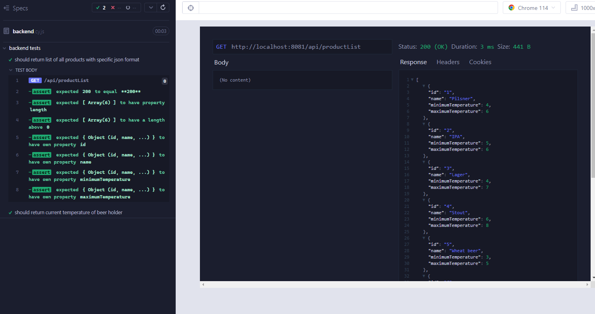
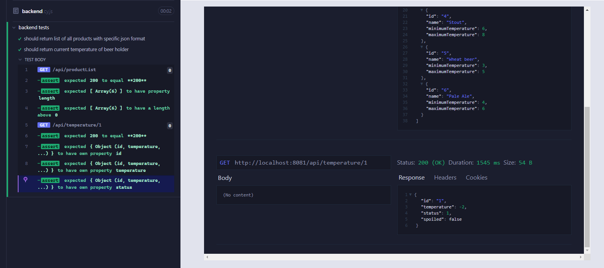
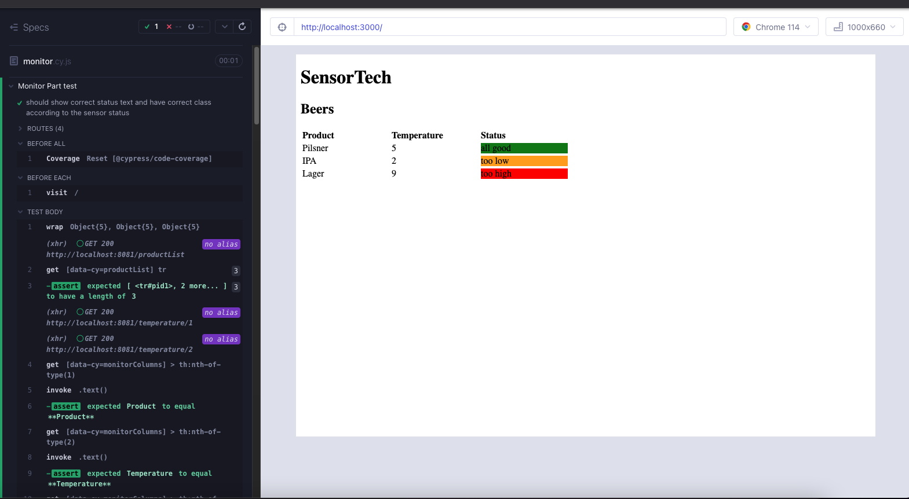
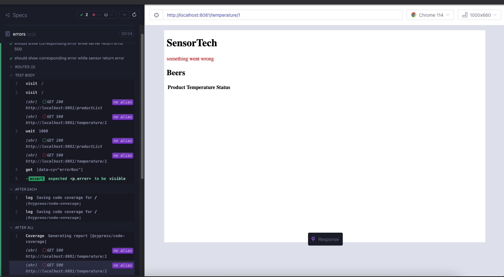

<h1 style="text-align: center">
 SensorTech Beer App
</h1>

## Full Description of the scenario:

SensorTech is a company that specialises in IoT, more specifically sensors. One of their
customers is a local craft brewery that uses refrigerated beer containers to transport every
different beer they produce to pubs around the region. They hired SensorTech to build a simple
solution that would let them know the current temperature of each beer container in their truck
and would notify them when a temperature is outside the correct range.
Each craft beer has its own specific refrigeration needs while being transported:

- Beer 1 (Pilsner): 4-6°C
- Beer 2 (IPA): 5-6°C
- Beer 3 (Lager): 4-7°C
- Beer 4 (Stout): 6-8°C
- Beer 5 (Witbier): 3-5°C
- Beer 6 (Pale Ale): 4-6°C

The brewery rushed SensorTech to deliver a working solution before the annual Craft Beer Festival, when sales (and
delivery) of beer go through the roof. As it unfortunately tends to happen, their engineers didn't pay much attention to
design, code quality or automated testing in order to hit the date. But SensorTech has now hired Pragmateam to improve
and deliver new features to this solution. As a Pragmateam software engineer, this is your first week working with this
client, and you are currently on a break from the Discovery workshop, where the team is planning the next release. You
decide to pick up a card from the Tech Debt Backlog and work on it. The card says:
Improve test coverage (refactor if needed)

## solution

This is a full-stack javascript (node/react) application for SensorTech company in order to monitor the current
temperature of each beer container in the Brewery trucks.
I changed the project from tow separated repo to a single repo with my favorite structure.
this project has two folders:

- 1- Backend (contains a very simple code to manage needed APIs about sensor statues)

- 2- frontend-web (contains a CRA code to show the list of sensors and current states)

# backend

we have two different get routes in the back code:

- /api/productList that returns the list of available products (beers)
  - here is the source code: [click here](/backend/index.js)
- /api/temperature/:id that return current temperature of beer each holder by passed id
  - you can see the code here: [click here](/backend/index.js)
  - this method uses a utility function to normalize the result object with a specific property named "status" that
    shows how far the temperature is away from normal temp.

# backed tests

all tests for this application are implemented by utilizing Cypress E2E test tool,
<br/>and I have used ["@cypress/code-coverage"](https://docs.cypress.io/guides/tooling/code-coverage) plugin to monitor
code-coverage reports.
<br/>additionally I have used [cypress-plugin-api](https://github.com/filiphric/cypress-plugin-api) plugin to visualize
the API test window.
<br/>in my opinion, by utilizing this plugin there is no need to use PostMan or swagger to test APIs anymore
<br/>there are two tests that are implemented in [backend.cy.js](./backend/cypress/e2e/backend.cy.js) as a spec file:

- [List Of Products](./backend/cypress/e2e/backend.cy.js) test results:



- [Get Product current state](./backend/cypress/e2e/backend.cy.js) test result:



# front end tests

For front-end tests, I separated all tests into two categories on different spec files:

- [monitor.cy.js](./frontend-web/cypress/e2e/monitor.cy.js) that contains a complete E2E test to cover the main flow of
  application in the frontend.
  - First, a mockup data file is imported and as you can see in
    the [sensors.json](./frontend-web/cypress/fixtures/sensors.json) file:
    - there is a product node that contains an array of mock products with the same format as the backend corresponding
      api response.
    - and a statue node that contains:
      - all possible status that may the backend api returns.
      - plus related classNames and messages that frontend would have while would get that status as a response.
  - then a seed command is called to register a stub function to return the mentioned mockup data while the '
    getProductList' backed api is called.
    - by that, I mean by utilizing the cy.intercept function we never call real backed api in this test.
  - as you can see in the test function body:
    - for each possible state a stub function is registered again by utilizing the cy.intercept functions.
    - if you have a look at [App.js,](./frontend-web/src/App.js) you realize that a special function is registered that:
      - will update the all loaded products' information (e.g temperature) in an interval every 5 seconds.
      - this update mechanism will run just after all products in loaded successfully.
    - so by utilizing cy.interceot function, we know that what should be evaluated in our assertions:
      - first, we are testifying the length of the products listed.
        > cy.get('[data-cy=productList] tr').should('have.length', 3);
        -  > in [sensors.json](./frontend-web/cypress/fixtures/sensors.json) file, we have just 3 different states.
      - then list columns' order and title are evaluated:
        > cy.get('[data-cy=monitorColumns] > th:nth-of-type(1)')
        .invoke('text')
        .should('equal', 'Product');

        > cy.get('[data-cy=monitorColumns] > th:nth-of-type(2)')
        .invoke('text')
        .should('equal', 'Temperature');

        > cy.get('[data-cy=monitorColumns] > th:nth-of-type(3)')
        .invoke('text')
        .should('equal', 'Status');
      - after that by utilizing a tricky loop the desired value and class assertions is evaluated:
      ```
         cy.wrap(sensors.statues).each((node) => {
          cy.get(`#pid${node.key}`)
             .find('[data-cy=statusCol]')
             .should('contain', node.value)
             .and('have.class', node.className);
        });
      ```
  - here is a screenshot of running this E2E test:
    


- [errors.cy.js](./frontend-web/cypress/e2e/errors.cy.js) that contains two different E2E tests:
  - unexpected error management is evaluated while reading the product list
  - unexpected error management is evaluated while getting the current temperature of particular product:
    - here as you can see before assertions, again by utilizing the cy.intercept function, a stub function is
      registered:
      ```
        cy.seedAndVisit([{
           id: '1',
           name: 'Pilsner',
           minimumTemperature: 4,
           maximumTemperature: 6,
        }]);
      ```
      > this seed function causes to have just one product in the list while the 'getProductList' api is called.
    - after that, by simulating an unexpected error response, while calling the get temperature api:
      > cy.intercept('GET', `${SERVER_URL}/temperature/1`, { statusCode: 500, body: 'error', });
    - showing an error message box, assertion is evaluated:
      ```
         cy.visit('/');
         cy.wait(1000);
         cy.get('[data-cy="errorBox"]').should('be.visible');
      ```
  - here is a screenshot of these assertions and tests result:
    

# code coverage

in order to monitor the code coverage, I utilize the cypress/code-coverage plugin and by using an excellent article
in [this address,](https://glebbahmutov.com/blog/backend-coverage/)
now the report of code coverage is available [here](https://naser-papi.github.io/SensorTechBeerApp/) and you can browse
and deep into the report.

# CI with docker 

